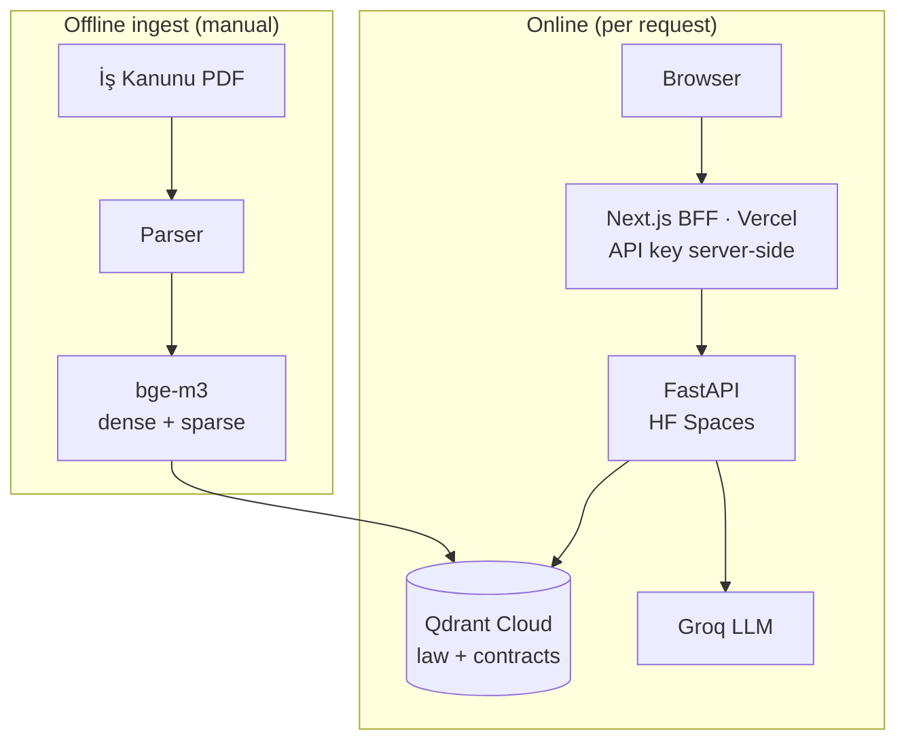

# İş Kanunu RAG

A retrieval-augmented Q&A and contract-analysis service over Turkish Labor Law
(İş Kanunu No. 4857). Every answer cites the exact article (madde) it's grounded
in — no supporting text, no claim.

**Live demo:** [labor-law-rag.vercel.app](https://labor-law-rag.vercel.app) ·
**API health:** [HF Space `/health`](https://dethx-labor-law-rag.hf.space/health)

## What it does

1. **Grounded Q&A** — ask a question about the law in Turkish; the answer cites
   the specific madde(ler) it's based on, or says the corpus doesn't cover it.
2. **Contract analysis** — upload an employment contract (PDF), and the system
   evaluates it clause-by-clause against the law: `compliant` / `risky` /
   `conflicts` / `not_addressed`, each with the article it's checked against.

Retrieved text (including contract text) is treated as data, not instructions —
a deliberate prompt-injection stance, since contract uploads are user-supplied.

## Architecture



- **Retrieval**: hybrid dense + sparse search (Reciprocal Rank Fusion) over one
  embedding model (`BAAI/bge-m3`), which is what makes a single model produce
  both vector types — measured against a dense-only baseline before adding it.
- **Contract analysis**: per-clause retrieval + strict-JSON verdicts, validated
  against a pydantic schema with one retry; a clause with no matching article
  is `not_addressed`, never an invented madde.
- **Frontend**: Next.js App Router, server-side BFF route handlers — the browser
  never sees the API key.
- **LLM**: provider-agnostic (`ollama` / `anthropic` / `openai_compatible` /
  `gemini`); the deployed demo runs Groq's free tier via `openai_compatible`.

Full design rationale (why bge-m3 over alternatives, why RRF over score mixing,
why no LangChain, etc.) lives in the project's internal architecture notes —
kept out of this public repo, available on request.

## Stack

Python 3.11 · FastAPI · Qdrant (hybrid dense+sparse retrieval) · `BAAI/bge-m3` ·
Next.js 16 (App Router) · TypeScript

## Running locally

```powershell
docker compose up -d                  # local Qdrant (ports 6333/6334)
pip install -r requirements.txt
python -m src.parsing                 # PDF -> data/processed/articles.json
python -m src.ingest                  # (re)build the `law` collection
uvicorn src.main:app --reload         # note the real port from the output
```

```powershell
cd frontend
npm install
npm run dev                           # http://localhost:3000
```

`frontend/.env.local` needs `RAG_API_URL` (the uvicorn URL above) and
`RAG_API_KEY` (matching the backend's `RAG_API_KEY`).

## Deferred for scale

Built to a measured need, not speculatively. Notably out of scope for now:
RAGAS faithfulness eval, query transformation (HyDE/multi-query), a shared
rate limiter across instances, response streaming, and observability
dashboards. Each is a deliberate, documented decision, not an oversight.

---

*Portfolio project. Not legal advice — every answer says so.*
